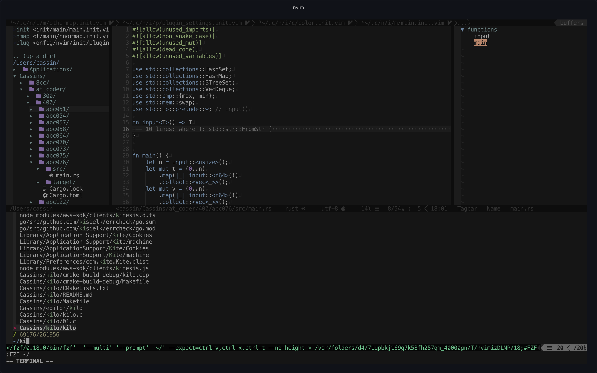
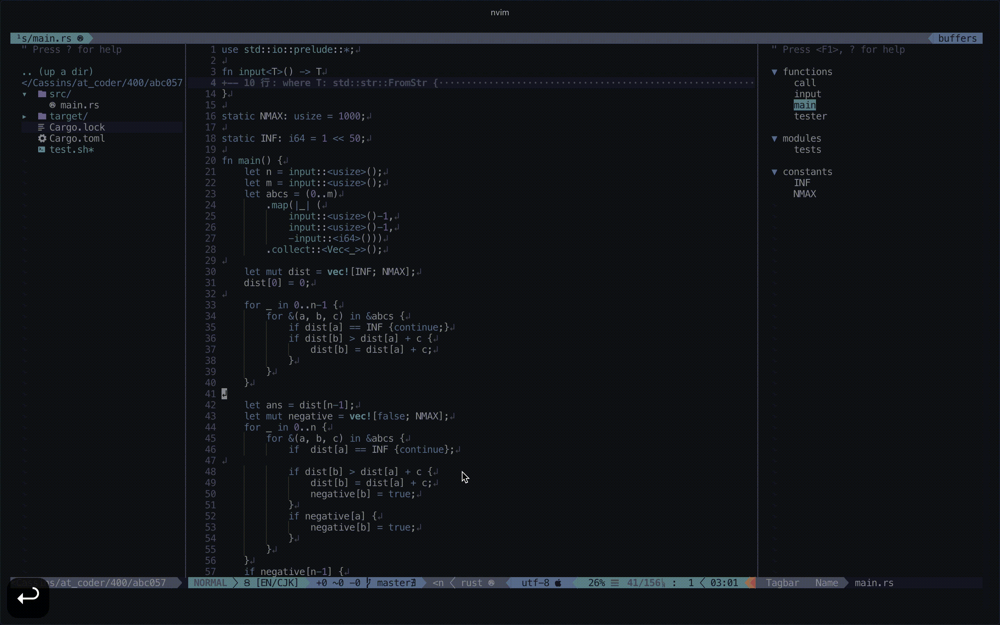
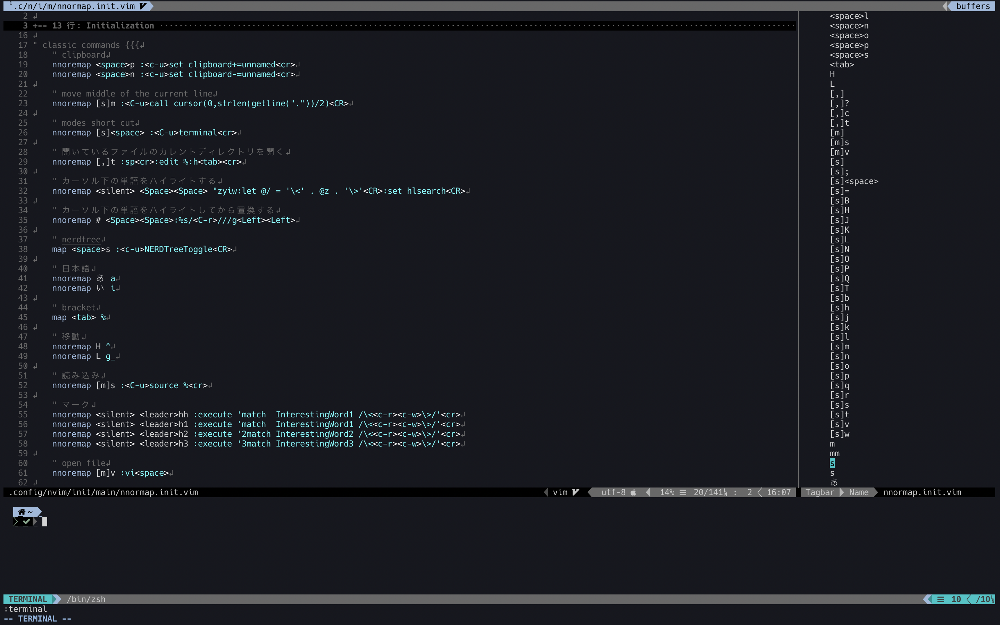

# ReiwaVimConfiguration

# Features

- **Powerful editing.** Use more than 80 plugins.

- **Simple key-bind.** systematized key-binding's prefix.

## Installation

0. ``pip3 install pynvim``
1. check ``let g:python3_host_prog``'s (at ``init/main/main.init.vim``) path is collect
2. Install [vim-plug](https://github.com/junegunn/vim-plug/releases) beforehand.
3. Set this code at ``~/.config/nvim/``.
4. ``pip3 install neovim-remote`` for ``mhinz/neovim-remote``
5. ``:PlugInstall`` for installing plugins

## Dependencies

### NerdFonts

Both ``Devicon-plugin`` and ``Airline-plugin`` require [nerd-fonts](https://github.com/ryanoasis/nerd-fonts).

### Mac

If you don't use this configuration on mac, You should remove this code from ``init/main/nnoremap.init.vim``.

```nnoremap.init.vim
" mac only!!!!!!!!!!!!!! {{{
    nnoremap ,? :!open dict://<cword><CR>
" }}}
```

# Screenshots

<h1 align="center">
  
  
  
</h1>

